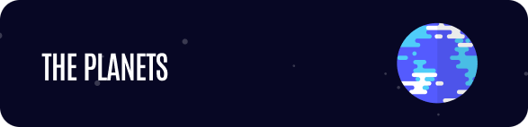

    
    
    
    

 

<h1>The Planets</h1>

<h2>🔖 Description</h2>

Planets differ from other objects such as comets, asteroids, and meteors. In general, planets are the largest objects in the solar system after the Sun, so would you like to take a look on these planets?

 

<h2>🚀 Technologies</h2>
<ul>
    <li><a href="https://create-react-app.dev/" target="_blank">React</a></li>
    <li><a href="https://reactrouter.com/" target="_blank">React Router</a></li>
    <li><a href="https://tailwindcss.com/" target="_blank">Tailwind</a></li>    
    <li><a href="https://vitejs.dev/" target="_blank">Vite</a></li>

</ul>

 

<h2>ℹ️ Click here to visit:</h2>
<a href="[https://my-link-one.vercel.app/](https://planets-henna.vercel.app/)" target="_blank">The Planets</a>

 
 

<h2>ℹ️ To run this project you need:</h2>

    Clone this repository
    $ git clone https://github.com/paulomiguelJS/planets.git

    Install dependencies
    $ yarn

    Run project
    $ yarn dev

 
Created with 💙 by <a href="https://github.com/paulomiguelJS/planets" target="_blank">Paulo Miguel</a>

